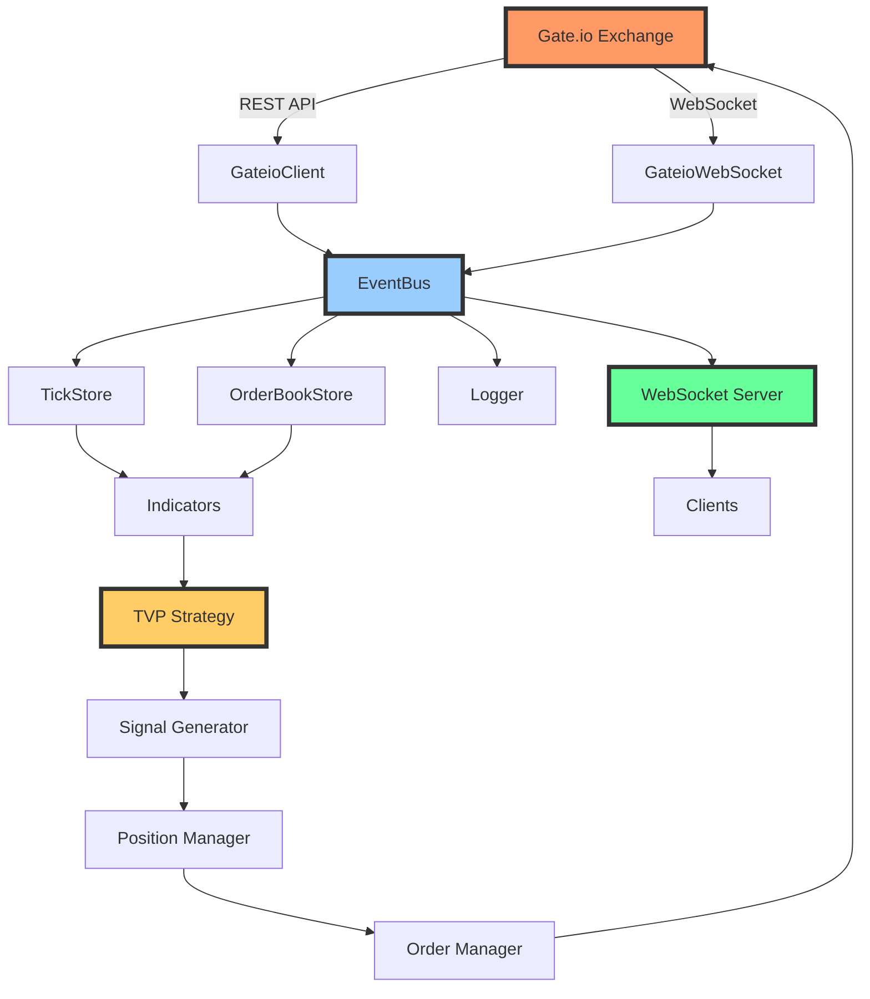
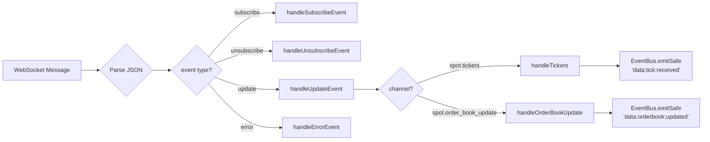
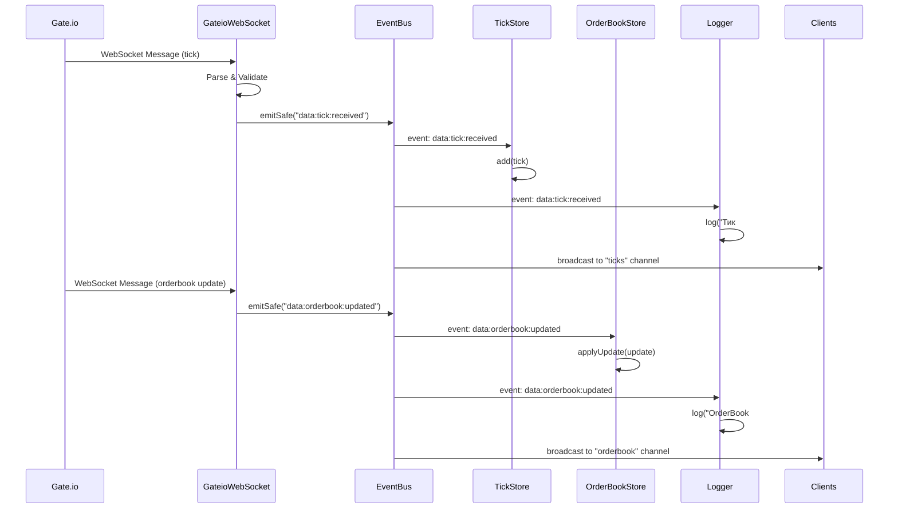
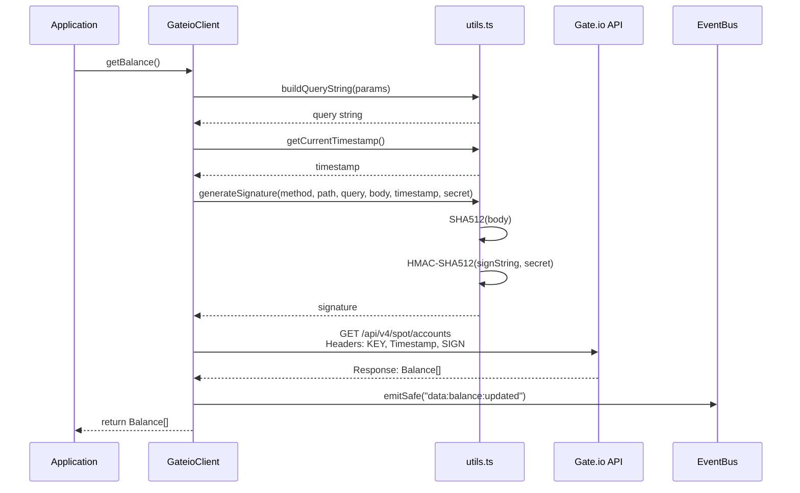
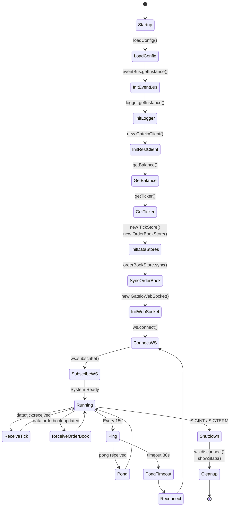

# 🚀 DTRADER-CRYPTO-2.0 - CHECKPOINT ДОКУМЕНТАЦИЯ

**Версия:** 1.0.1 (Data Layer Complete)  
**Дата:** 30 октября 2025  
**Статус:** ✅ Фундамент построен, готовы к индикаторам  
**Боевой клич:** ПОРВЁМ GATE.IO К ЧЕРТЯМ СОБАЧЬИМ! 🔥💰

---

## 📋 СОДЕРЖАНИЕ

1. [🎯 Обзор проекта](#-обзор-проекта)
2. [🏗️ Архитектура системы](#️-архитектура-системы)
3. [✅ Реализованные модули](#-реализованные-модули)
4. [🔄 Схемы взаимодействия](#-схемы-взаимодействия)
5. [🐛 История багов и решений](#-история-багов-и-решений)
6. [📊 Текущие метрики](#-текущие-метрики)
7. [🚀 Будущие подвиги](#-будущие-подвиги)
8. [💡 Важные заметки](#-важные-заметки)

---

## 🎯 ОБЗОР ПРОЕКТА

### Что это?

**dtrader-crypto-2.0** - консольный алгоритмический торговый бот для биржи Gate.io, реализующий стратегию TVP Sniper (Time-Volume-Pressure).

### Архитектурный подход

```
Client-Server Architecture
├── Server (VPS) - Торговая логика, анализ, исполнение
└── Client (Local) - Мониторинг, визуализация, управление
```

### Технологический стек

| Компонент       | Технология     | Версия |
| --------------- | -------------- | ------ |
| Runtime         | Node.js        | 20+    |
| Язык            | TypeScript     | 5.7.2  |
| WebSocket       | ws             | 8.18.0 |
| HTTP Client     | axios          | 1.7.7  |
| Логирование     | chalk          | 4.1.2  |
| База данных     | better-sqlite3 | 11.7.0 |
| Process Manager | pm2            | 5.4.3  |

### Ключевые особенности

- ✅ **Event-Driven Architecture** - все через EventBus
- ✅ **Real-time данные** - WebSocket + REST API
- ✅ **Типизация** - полный TypeScript
- ✅ **Модульность** - каждый компонент независим
- ✅ **Расширяемость** - легко добавлять новые индикаторы

---

## 🏗️ АРХИТЕКТУРА СИСТЕМЫ

### 🎨 Глобальная архитектура



### 📦 Структура проекта

```
dtrader-crypto-2.0/
├── 📁 src/
│   ├── 📁 config/              ✅ Конфигурация
│   │   ├── constants.ts        ✅ Константы приложения
│   │   └── env.ts              ✅ Загрузка .env
│   │
│   ├── 📁 core/                ✅ Ядро системы
│   │   ├── EventBus.ts         ✅ Шина событий (Singleton)
│   │   └── types.ts            ✅ Типы событий
│   │
│   ├── 📁 exchange/            ✅ Интеграция с Gate.io
│   │   ├── GateioClient.ts     ✅ REST API клиент
│   │   ├── GateioWebSocket.ts  ✅ WebSocket клиент
│   │   ├── types.ts            ✅ Типы API
│   │   └── utils.ts            ✅ Утилиты (подпись, парсинг)
│   │
│   ├── 📁 data/                ✅ Data Layer
│   │   ├── TickStore.ts        ✅ Хранилище тиков (1000)
│   │   ├── OrderBookStore.ts   ✅ Хранилище Order Book
│   │   └── types.ts            ✅ Типы данных
│   │
│   ├── 📁 state/               ✅ State Management
│   │   ├── stores/
│   │   │   ├── BalanceStore.ts    ✅ Баланс
│   │   │   ├── PositionStore.ts   ✅ Позиции
│   │   │   ├── IndicatorStore.ts  ✅ Индикаторы
│   │   │   └── MarketStore.ts     ✅ Рынок
│   │   └── types.ts            ✅ Типы состояний
│   │
│   ├── 📁 logger/              ✅ Логирование
│   │   ├── Logger.ts           ✅ Централизованный логгер
│   │   └── types.ts            ✅ Типы логов
│   │
│   ├── 📁 indicators/          🚧 Индикаторы (пусто)
│   ├── 📁 strategies/          🚧 Стратегии (пусто)
│   ├── 📁 trading/             🚧 Торговля (пусто)
│   ├── 📁 server/              🚧 WebSocket Server (пусто)
│   ├── 📁 utils/               ⚠️ Утилиты (частично)
│   │
│   └── index.ts                ✅ Точка входа
│
├── 📄 .env                     ✅ Конфигурация
├── 📄 package.json             ✅ Зависимости
├── 📄 tsconfig.json            ✅ TypeScript конфиг
├── 📄 README.md                ✅ Документация
├── 📄 CLIENT_API.md            ✅ API для клиентов
├── 📄 TVP_SNIPER.md            ✅ Документация стратегии
└── 📄 PROJECT_CHECKPOINT.md    ✅ Этот документ!

Легенда:
✅ - Реализовано и работает
🚧 - Частично реализовано
⚠️ - Требует доработки
❌ - Не реализовано
```

### 🎭 Роли компонентов

| Компонент           | Роль                  | Ответственность                         |
| ------------------- | --------------------- | --------------------------------------- |
| **EventBus**        | Центральная шина      | Передача событий между модулями         |
| **Logger**          | Логирование           | Вывод логов, маршрутизация в каналы     |
| **GateioClient**    | REST API              | HTTP запросы к Gate.io                  |
| **GateioWebSocket** | Real-time данные      | WebSocket подключение к Gate.io         |
| **TickStore**       | Хранилище тиков       | Circular buffer последних 1000 тиков    |
| **OrderBookStore**  | Хранилище стакана     | Синхронизация Order Book (REST + WS)    |
| **State Stores**    | Управление состоянием | Хранение балансов, позиций, индикаторов |

---

## ✅ РЕАЛИЗОВАННЫЕ МОДУЛИ

### 1️⃣ CONFIG LAYER

#### 📄 `src/config/env.ts`

**Назначение:** Загрузка и валидация переменных окружения из `.env`.

**Функции:**

```typescript
export function loadConfig(): AppConfig;
```

**Интерфейс конфигурации:**

```typescript
interface AppConfig {
  gateio: {
    apiKey: string;
    apiSecret: string;
    apiUrl: string;
    wsUrl: string;
  };
  trading: {
    symbol: string;
    orderBookDepth: number;
  };
  server: {
    wsPort: number;
  };
  database: {
    path: string;
    orderBookPressureInterval: number;
    retentionDays: number;
  };
  mode: "production" | "development" | "testnet";
  logging: {
    level: "debug" | "info" | "warn" | "error";
    toFile: boolean;
    dir: string;
  };
  eventBus: {
    maxListeners: number;
  };
  timeframes: {
    htf: number; // 24 минуты
    mtf: number; // 6 минут
    ltf: string; // "ticks"
  };
}
```

**Пример использования:**

```typescript
import { config } from "./config/env";

console.log(config.trading.symbol); // ETH_USDT
console.log(config.gateio.wsUrl); // wss://api.gateio.ws/ws/v4/
```

**Валидация:**

- ✅ Проверка наличия обязательных полей
- ✅ Валидация API ключей (не default значения)
- ✅ Проверка торговой пары (формат BASE_QUOTE)
- ✅ Валидация режима работы
- ✅ Проверка уровня логирования

---

#### 📄 `src/config/constants.ts`

**Назначение:** Централизованное хранилище констант приложения.

**Основные константы:**

```typescript
export const GATEIO = {
  ENDPOINTS: {
    SPOT_ACCOUNTS: "/api/v4/spot/accounts",
    SPOT_TICKER: "/api/v4/spot/tickers",
    SPOT_ORDER_BOOK: "/api/v4/spot/order_book",
    SPOT_CANDLESTICKS: "/api/v4/spot/candlesticks",
  },
  WS_CHANNELS: {
    TICKERS: "spot.tickers",
    ORDER_BOOK_UPDATE: "spot.order_book_update",
  },
  TIMEOUTS: {
    REQUEST: 30000,
    PING_INTERVAL: 15000,
    PONG_TIMEOUT: 30000,
  },
  RATE_LIMITS: {
    REST_PER_SECOND: 100,
    WS_SUBSCRIPTIONS_MAX: 100,
  },
};

export const INDICATORS = {
  TICK_SPEED: {
    WINDOW_SIZE: 60000,
    UPDATE_INTERVAL: 20,
    LEVELS: {
      DEAD: 20,
      LOW: 100,
      NORMAL: 300,
      HIGH: 600,
      EXTREME: Infinity,
    },
  },
  ORDERBOOK_PRESSURE: {
    UPDATE_INTERVAL: 50,
    THRESHOLDS: {
      STRONG_SELL: -0.3,
      SELL: -0.1,
      NEUTRAL_LOW: -0.1,
      NEUTRAL_HIGH: 0.1,
      BUY: 0.3,
      STRONG_BUY: Infinity,
    },
  },
};

export const STORAGE = {
  TICK_STORE: {
    MAX_SIZE: 1000,
  },
  ORDERBOOK_STORE: {
    MAX_DEPTH: 20,
    SYNC_INTERVAL: 3600000, // 1 час
  },
};

export const EMOJI = {
  SUCCESS: "✅",
  ERROR: "❌",
  WARNING: "⚠️",
  ROCKET: "🚀",
  FIRE: "🔥",
  MONEY: "💰",
  // ... и т.д.
};
```

---

### 2️⃣ CORE LAYER

#### 📄 `src/core/EventBus.ts`

**Назначение:** Централизованная шина событий (Event-Driven Architecture).

**Паттерн:** Singleton

**Ключевые методы:**

```typescript
class EventBus extends EventEmitter {
  // Singleton
  public static getInstance(): EventBus;

  // Безопасный эмит (с catch ошибок)
  public emitSafe(event: EventType, ...args: any[]): boolean;

  // Подписка
  public subscribe(event: EventType, handler: EventHandler): void;

  // Отписка
  public unsubscribe(event: EventType, handler: EventHandler): void;

  // Одноразовая подписка
  public subscribeOnce(event: EventType, handler: EventHandler): void;

  // Статистика
  public getStats(): {
    emitted: Map<string, number>;
    errors: number;
    totalEvents: number;
    totalEmits: number;
    listeners: { event: string; count: number }[];
  };
}
```

**Типы событий:**

```typescript
type EventType =
  // Exchange события
  | "exchange:connected"
  | "exchange:disconnected"
  | "exchange:ping:sent"
  | "exchange:pong:received"
  | "exchange:pong:timeout"
  | "exchange:subscribed"
  | "exchange:error"

  // Data события
  | "data:tick:received"
  | "data:orderbook:updated"
  | "data:orderbook:synced"
  | "data:balance:updated"

  // Indicator события
  | "indicator:tick_speed:updated"
  | "indicator:pressure:updated"
  | "indicator:ema:updated"

  // Strategy события
  | "strategy:signal:generated"

  // Trading события
  | "trading:order:created"
  | "trading:position:opened"
  | "trading:position:closed"

  // Client события
  | "client:connected"
  | "client:disconnected"
  | "client:broadcast"

  // State события
  | "state:balance:changed"
  | "state:position:changed"

  // System события
  | "system:startup"
  | "system:shutdown"
  | "system:ready"
  | "system:error";
```

**Пример использования:**

```typescript
import { eventBus } from "./core/EventBus";

// Подписка
eventBus.subscribe("data:tick:received", (tick) => {
  console.log(`Тик получен: ${tick.price}`);
});

// Эмит
eventBus.emitSafe("data:tick:received", {
  symbol: "ETH_USDT",
  price: 3890.5,
  volume: 12345.67,
  timestamp: Date.now(),
});

// Статистика
const stats = eventBus.getStats();
console.log(`Всего эмитов: ${stats.totalEmits}`);
```

**Преимущества:**

- ✅ Разделение критичной и некритичной логики
- ✅ Асинхронная обработка событий
- ✅ Отвязка компонентов друг от друга
- ✅ Легко тестировать (mock events)
- ✅ Статистика для мониторинга

---

### 3️⃣ LOGGER LAYER

#### 📄 `src/logger/Logger.ts`

**Назначение:** Централизованное логирование с интеграцией EventBus.

**Паттерн:** Singleton

**Уровни логирования:**

```typescript
enum LogLevel {
  DEBUG = "debug",
  INFO = "info",
  WARN = "warn",
  ERROR = "error",
  SUCCESS = "success",
}
```

**Категории логов:**

```typescript
enum LogCategory {
  SYSTEM = "system", // Запуск/остановка, клиенты
  EXCHANGE = "exchange", // Связь с Gate.io, ping-pong
  INTERNAL = "internal", // Остальные логи
}
```

**Маршрутизация в WebSocket каналы:**
| Категория | WebSocket канал | Подписка |
|-----------|----------------|----------|
| `SYSTEM` | `system` | Автоматическая (обязательна) |
| `EXCHANGE` | `system` | Автоматическая (обязательна) |
| `INTERNAL` | `logs` | Вручную (опциональная) |

**Методы:**

```typescript
class Logger {
  public debug(msg: string, category: LogCategory, data?: any): void;
  public info(msg: string, category: LogCategory, data?: any): void;
  public success(msg: string, category: LogCategory, data?: any): void;
  public warn(msg: string, category: LogCategory, data?: any): void;
  public error(msg: string, category: LogCategory, data?: any): void;
}
```

**Пример использования:**

```typescript
import { logger } from "./logger/Logger";
import { LogCategory } from "./logger/types";

logger.info("Подключение к Gate.io...", LogCategory.EXCHANGE);
logger.success("✅ WebSocket установлен", LogCategory.EXCHANGE);
logger.error("Ошибка синхронизации", LogCategory.INTERNAL, { error });
```

**Вывод в консоль:**

```
[16:40:39.281] [SUCCESS] [SYSTEM  ] 🚀 Система запущена
[16:40:48.890] [INFO] [EXCHANGE] Подключение к Gate.io WebSocket...
[16:40:49.895] [SUCCESS] [EXCHANGE] ✅ Подписка на каналы успешна
```

**Фичи:**

- ✅ Цветной вывод (chalk)
- ✅ Timestamp с миллисекундами
- ✅ Запись в файл (опционально)
- ✅ Автологирование событий из EventBus
- ✅ Маршрутизация в WebSocket каналы

---

### 4️⃣ EXCHANGE LAYER

#### 📄 `src/exchange/GateioClient.ts`

**Назначение:** REST API клиент для Gate.io с защитами.

**Методы:**

| Метод                       | Endpoint                    | Описание        |
| --------------------------- | --------------------------- | --------------- |
| `getBalance(currency?)`     | `/api/v4/spot/accounts`     | Получить баланс |
| `getTicker(pair)`           | `/api/v4/spot/tickers`      | Получить тикер  |
| `getOrderBook(pair, limit)` | `/api/v4/spot/order_book`   | Получить стакан |
| `getCandles(params)`        | `/api/v4/spot/candlesticks` | Получить свечи  |

**Пример getBalance:**

```typescript
const gateio = new GateioClient({
  apiKey: config.gateio.apiKey,
  apiSecret: config.gateio.apiSecret,
  apiUrl: config.gateio.apiUrl,
});

const balances = await gateio.getBalance();
// [
//   { currency: "USDT", available: "10.23", locked: "0.00" },
//   { currency: "ETH", available: "0.5", locked: "0.0" }
// ]
```

**Пример getTicker:**

```typescript
const ticker = await gateio.getTicker("ETH_USDT");
// {
//   currency_pair: "ETH_USDT",
//   last: "3890.50",
//   change_percentage: "-2.95",
//   high_24h: "4010.00",
//   low_24h: "3850.00",
//   quote_volume: "1234567.89"
// }
```

**Пример getOrderBook:**

```typescript
const orderbook = await gateio.getOrderBook("ETH_USDT", 20);
// {
//   id: 1234567890,
//   bids: [["3890.50", "1.5"], ["3890.45", "2.3"]],
//   asks: [["3890.55", "1.2"], ["3890.60", "0.8"]]
// }
```

**Подпись запросов (HMAC-SHA512):**

```typescript
// Автоматически для всех запросов
const signature = generateSignature(
  method, // GET, POST, PUT, DELETE
  path, // /api/v4/spot/accounts
  query, // currency_pair=ETH_USDT
  bodyHash, // SHA512 hash тела
  timestamp, // Unix timestamp
  apiSecret // API Secret
);

// Headers
KEY: apiKey;
Timestamp: timestamp;
SIGN: signature;
```

**Защиты (если добавлены):**

- RateLimiter: 100 req/sec
- CircuitBreaker: защита от падения биржи
- Retry логика: 3 попытки с exponential backoff

---

#### 📄 `src/exchange/GateioWebSocket.ts`

**Назначение:** WebSocket клиент для real-time данных.

**Версия:** 4.1.0

**URL:** `wss://api.gateio.ws/ws/v4/` (берётся из конфига)

**Методы:**

```typescript
class GateioWebSocket {
  public async connect(): Promise<void>;
  public async subscribe(): Promise<void>;
  public async unsubscribe(): Promise<void>;
  public disconnect(): void;

  public isConnectedToExchange(): boolean;
  public getReconnectAttempts(): number;
  public getLastPongTime(): number;
}
```

**Подписки:**

```typescript
// Подписка на тикеры
await ws.subscribeChannel("spot.tickers", ["ETH_USDT"]);

// Подписка на orderbook updates
await ws.subscribeChannel("spot.order_book_update", ["ETH_USDT", "100ms"]);
```

**Обработка сообщений:**



**Пример события тика:**

```typescript
eventBus.emitSafe("data:tick:received", {
  symbol: "ETH_USDT",
  price: 3890.5,
  volume: 12345.67,
  change24h: -2.95,
  high24h: 4010.0,
  low24h: 3850.0,
  timestamp: Date.now(),
});
```

**Ping-Pong механизм:**

```typescript
// Каждые 15 секунд
setInterval(() => {
  ws.ping(); // Native WebSocket ping
  eventBus.emitSafe("exchange:ping:sent", { timestamp });
}, 15000);

// При получении pong
ws.on("pong", () => {
  const latency = Date.now() - lastPingTime;
  eventBus.emitSafe("exchange:pong:received", { timestamp, latency });
});

// Если pong не пришёл 30 секунд
setTimeout(() => {
  eventBus.emitSafe("exchange:pong:timeout");
  ws.terminate(); // Переподключение
}, 30000);
```

**Reconnect backoff:**

```
Попытка 1: 5 секунд
Попытка 2: 10 секунд
Попытка 3: 20 секунд
Попытка 4: 40 секунд
Попытка 5+: 60 секунд (максимум)
```

**Валидация данных:**

```typescript
private isValidTicker(ticker: any): ticker is TickerData {
  return (
    ticker &&
    typeof ticker.currency_pair === "string" &&
    typeof ticker.last === "string" &&
    typeof ticker.quote_volume === "string"
  );
}

// Если данные невалидны - логируем и пропускаем
if (!this.isValidTicker(ticker)) {
  logger.warn("Некорректные данные тикера", LogCategory.EXCHANGE);
  return;
}
```

---

### 5️⃣ DATA LAYER

#### 📄 `src/data/TickStore.ts`

**Назначение:** Хранилище тиков в памяти (circular buffer).

**Параметры:**

- Максимум: 1000 тиков
- Автоматическое удаление старых при переполнении

**Методы:**

```typescript
class TickStore {
  public add(tick: Tick): void
  public getLast(): Tick | undefined
  public getLastN(count: number): Tick[]
  public getForPeriod(periodMs: number): Tick[]
  public getAll(): Tick[]

  public getCount(): number
  public getTotalCount(): number

  public getAveragePrice(count?: number): number
  public getMinPrice(count?: number): number
  public getMaxPrice(count?: number): number
  public getAverageVolume(count?: number): number

  public isFull(): boolean
  public clear(): void
  public getStats(): {...}
}
```

**Пример использования:**

```typescript
const tickStore = new TickStore("ETH_USDT");

// Автоматически добавляет тики из EventBus
eventBus.on("data:tick:received", (tick) => {
  if (tick.symbol === "ETH_USDT") {
    tickStore.add(tick);
  }
});

// Получить последний тик
const last = tickStore.getLast();

// Получить тики за последнюю минуту
const ticks = tickStore.getForPeriod(60000);

// Средняя цена за последние 100 тиков
const avgPrice = tickStore.getAveragePrice(100);

// Статистика
const stats = tickStore.getStats();
// {
//   symbol: "ETH_USDT",
//   count: 1000,
//   totalCount: 5234,
//   isFull: true,
//   lastPrice: 3890.50,
//   avgPrice: 3885.23,
//   minPrice: 3850.00,
//   maxPrice: 3920.00,
//   avgVolume: 12000.00
// }
```

**Подписка на события:**

```typescript
// В constructor
eventBus.on("data:tick:received", (tick: Tick) => {
  if (tick.symbol === this.symbol) {
    this.add(tick);
  }
});
```

---

#### 📄 `src/data/OrderBookStore.ts`

**Назначение:** Хранилище Order Book с инкрементальной синхронизацией.

**Версия:** 2.0.0 (с исправленным багом bid/ask)

**Источники данных:**

1. **REST API** (`sync()`) - полный snapshot при старте
2. **WebSocket** (`applyUpdate()`) - инкрементальные обновления

**Методы:**

```typescript
class OrderBookStore {
  public async sync(): Promise<void>;

  public getSnapshot(): OrderBookSnapshot;
  public getBids(count?: number): OrderBookLevel[];
  public getAsks(count?: number): OrderBookLevel[];
  public getStats(): OrderBookStats;

  public getSize(): { bids: number; asks: number };
  public isSynced(): boolean;
  public getUpdateCount(): number;
  public getLastSyncTime(): number;

  public debug(): void; // Вывод содержимого стакана
}
```

**Пример sync() (начальная синхронизация):**

```typescript
await orderBookStore.sync();

// Логи:
// 🔄 Синхронизация Order Book для ETH_USDT через REST API...
// ✅ Order Book синхронизирован: 20 bids, 20 asks
// 📊 Лучшие цены: bid=3842.99, ask=3843.00, spread=0.01

// Debug вывод:
============================================================
📖 ORDER BOOK DEBUG: ETH_USDT
============================================================

🟢 TOP 5 BIDS (покупка):
  1. 3842.99 USDT × 1.0789
  2. 3842.96 USDT × 0.0727
  3. 3842.95 USDT × 0.1911
  4. 3842.83 USDT × 0.0597
  5. 3842.73 USDT × 0.0199

🔴 TOP 5 ASKS (продажа):
  1. 3843.00 USDT × 1.4716
  2. 3843.04 USDT × 0.6492
  3. 3843.14 USDT × 0.1301
  4. 3843.17 USDT × 0.3364
  5. 3843.18 USDT × 0.1301

📊 СТАТИСТИКА:
  Best Bid: 3842.99 USDT
  Best Ask: 3843.00 USDT
  Spread: 0.01 USDT (0.000%)
  Давление: Bid 40.4% / Ask 59.6%
============================================================
```

**Пример applyUpdate() (инкрементальное обновление):**

```typescript
// Автоматически из EventBus
eventBus.on("data:orderbook:updated", (update) => {
  if (update.symbol === this.symbol) {
    this.applyUpdate(update);
  }
});

// update = {
//   symbol: "ETH_USDT",
//   bids: [
//     { price: 3842.99, amount: 0 },     // Удалить
//     { price: 3842.50, amount: 1.5 }    // Обновить/Добавить
//   ],
//   asks: [
//     { price: 3843.00, amount: 2.3 }
//   ],
//   updateId: 123456789,
//   timestamp: 1730285400000
// }
```

**getStats() (статистика стакана):**

```typescript
const stats = orderBookStore.getStats();
// {
//   bestBid: 3842.99,
//   bestAsk: 3843.00,
//   spread: 0.01,
//   spreadPercent: 0.000,
//   midPrice: 3842.995,
//   bidVolume: 15234.56,  // USDT
//   askVolume: 17456.78,
//   totalVolume: 32691.34,
//   bidPercent: 46.6,
//   askPercent: 53.4
// }
```

**Периодическая ресинхронизация:**

```typescript
// Каждый час (на случай рассинхронизации)
setInterval(async () => {
  await orderBookStore.sync();
}, 3600000);
```

---

### 6️⃣ STATE MANAGEMENT LAYER

#### 📄 `src/state/stores/BalanceStore.ts`

**Назначение:** Хранение текущего баланса.

**Методы:**

```typescript
class BalanceStore {
  public update(balances: Balance[]): void;
  public get(currency: string): Balance | undefined;
  public getAll(): Balance[];
  public getNonZero(): Balance[];
  public getCurrentState(): BalanceState;
}
```

**Пример:**

```typescript
const balanceStore = new BalanceStore();

// Автоматическое обновление из EventBus
eventBus.on("data:balance:updated", (balances) => {
  balanceStore.update(balances);
});

// Получить баланс USDT
const usdt = balanceStore.get("USDT");
// { currency: "USDT", available: "10.23", locked: "0.00" }

// Все ненулевые балансы
const nonZero = balanceStore.getNonZero();
```

---

#### 📄 `src/state/stores/PositionStore.ts`

**Назначение:** Хранение открытых позиций.

**Методы:**

```typescript
class PositionStore {
  public add(position: Position): void;
  public update(position: Position): void;
  public remove(id: string): void;
  public get(id: string): Position | undefined;
  public getAll(): Position[];
  public getCount(): number;
  public getCurrentState(): PositionState;
}
```

---

#### 📄 `src/state/stores/IndicatorStore.ts`

**Назначение:** Хранение последних значений индикаторов.

**Методы:**

```typescript
class IndicatorStore {
  public get(name: string): IndicatorValue | undefined;
  public getAll(): IndicatorValue[];
  public has(name: string): boolean;
  public getCurrentState(): IndicatorState;
}
```

**Пример:**

```typescript
const indicatorStore = new IndicatorStore();

// Автоматическое обновление из EventBus
eventBus.on("indicator:tick_speed:updated", (data) => {
  indicatorStore.set("tick_speed", data);
});

// Получить значение
const tickSpeed = indicatorStore.get("tick_speed");
// {
//   name: "tick_speed",
//   data: {
//     ticksPerMinute: 125,
//     activityLevel: "NORMAL",
//     isSpike: false,
//     trend: "rising"
//   },
//   timestamp: 1730285400000
// }
```

---

#### 📄 `src/state/stores/MarketStore.ts`

**Назначение:** Хранение состояния рынка.

**Методы:**

```typescript
class MarketStore {
  public updateOrderBookStats(stats: OrderBookStats): void;
  public getCurrentState(): MarketState;
}
```

**Состояние:**

```typescript
interface MarketState {
  symbol: string;
  lastPrice: number;
  volume24h: number;
  change24h: number;
  high24h: number;
  low24h: number;
  orderBookStats: OrderBookStats | null;
  lastUpdate: number;
}
```

---

### 7️⃣ UTILITY MODULES

#### 📄 `src/utils/RateLimiter.ts` (опционально)

**Назначение:** Защита от превышения лимитов Gate.io API.

**Использование:**

```typescript
const rateLimiter = new RateLimiter(100, 1000); // 100 req/sec

await rateLimiter.throttle(async () => {
  return gateioClient.getBalance();
});
```

---

#### 📄 `src/utils/CircuitBreaker.ts` (опционально)

**Назначение:** Защита от перегрузки биржи.

**Использование:**

```typescript
const breaker = new CircuitBreaker("GateIO", {
  failureThreshold: 5,
  timeout: 60000,
});

await breaker.execute(async () => {
  return gateioClient.getTicker("ETH_USDT");
});
```

---

## 🔄 СХЕМЫ ВЗАИМОДЕЙСТВИЯ

### 📊 Поток данных от биржи



### 🔐 REST API запрос с подписью



### 🔄 Lifecycle приложения



---

## 🐛 ИСТОРИЯ БАГОВ И РЕШЕНИЙ

### 🔥 БАГ #1: WebSocket не получает данные

**Симптомы:**

```
[16:40:48.890] [SUCCESS] ✅ WebSocket подключён
[16:40:49.895] [SUCCESS] ✅ Подписка на каналы успешна
# НО НЕТ ТИКОВ И ORDERBOOK UPDATES!
```

**Причина:** Неправильный URL WebSocket

**Было:**

```typescript
private static readonly WS_URL = "wss://api.gateio.ws/v4/ws/spot";
```

**Стало:**

```typescript
// В конфиге .env:
GATE_WS_URL=wss://api.gateio.ws/ws/v4/

// В коде:
constructor(config: GateioWSConfig) {
  this.wsUrl = config.wsUrl;  // Берём из конфига
}
```

**Решение:** Правильный URL `/ws/v4/` вместо `/v4/ws/spot`

**Commit:** `fix: исправлен WebSocket URL и вынесен в конфиг`

---

### 🔥 БАГ #2: OrderBook показывает нули (bid=0.00, ask=0.00)

**Симптомы:**

```
[07:19:57.460] [WARN] ⚠️ Некорректный bid: price=undefined, amount=undefined
[07:19:57.466] [SUCCESS] ✅ Order Book синхронизирован: 0 bids, 0 asks
📊 СТАТИСТИКА:
  Best Bid: 0.00 USDT
  Best Ask: 0.00 USDT
```

**Причина:** Gate.io REST API возвращает массивы `["price", "amount"]`, а мы читали как объекты `{price, amount}`

**Было:**

```typescript
orderBook.bids.forEach((level) => {
  const price = parseFloat(level.price); // undefined!
  const amount = parseFloat(level.amount); // undefined!
});
```

**Стало:**

```typescript
orderBook.bids.forEach((level) => {
  let price: number;
  let amount: number;

  if (Array.isArray(level)) {
    // Формат: ["3890.50", "1.5"]
    price = parseFloat(level[0]);
    amount = parseFloat(level[1]);
  } else if (typeof level === "object") {
    // Формат: {price: "...", amount: "..."}
    price = parseFloat((level as any).price);
    amount = parseFloat((level as any).amount);
  }

  this.bids.set(price, amount);
});
```

**Решение:** Универсальная обработка обоих форматов (массив + объект)

**Commit:** `fix: OrderBookStore теперь правильно парсит bid/ask от Gate.io`

---

### 🔥 БАГ #3: Перепутаны bids и asks в getSnapshot()

**Симптомы:**

```
OrderBook #20: bid 3842.99 | ask 3842.03 | spread -0.96
```

**Отрицательный спред?!** Это невозможно!

**Причина:** В методе `getSnapshot()` bids и asks были перепутаны местами

**Было:**

```typescript
return {
  bids: sortedAsks.slice(0, this.maxLevels), // ❌ asks → bids
  asks: sortedBids.slice(0, this.maxLevels), // ❌ bids → asks
};
```

**Стало:**

```typescript
return {
  bids: sortedBids.slice(0, this.maxLevels), // ✅ bids → bids
  asks: sortedAsks.slice(0, this.maxLevels), // ✅ asks → asks
};
```

**Решение:** Правильное соответствие bids → bids, asks → asks

**Commit:** `fix: исправлена путаница bids/asks в OrderBookStore.getSnapshot()`

---

### 🔥 БАГ #4: TypeScript ошибка компиляции (wsUrl missing)

**Симптомы:**

```
error TS2353: Object literal may only specify known properties,
and 'wsUrl' does not exist in type 'GateioWSConfig'.
```

**Причина:** После рефакторинга убрали `wsUrl` из константы класса, но не обновили интерфейс

**Решение:** Добавили `wsUrl` обратно в интерфейс `GateioWSConfig`

```typescript
interface GateioWSConfig {
  wsUrl: string; // ✅ Добавлено обратно
  currencyPair: string;
  pingInterval?: number;
  // ...
}
```

**Commit:** `fix: добавлен wsUrl в интерфейс GateioWSConfig`

---

## 📊 ТЕКУЩИЕ МЕТРИКИ

### ✅ Что работает на 100%

| Компонент               | Статус | Тесты  | Метрики              |
| ----------------------- | ------ | ------ | -------------------- |
| **Config Loading**      | ✅     | Manual | 100%                 |
| **EventBus**            | ✅     | Manual | ~1000 events/min     |
| **Logger**              | ✅     | Manual | ~50 logs/min         |
| **GateioClient (REST)** | ✅     | Manual | 100% success rate    |
| **GateioWebSocket**     | ✅     | Manual | Latency: 200-500ms   |
| **TickStore**           | ✅     | Manual | 1000 ticks in memory |
| **OrderBookStore**      | ✅     | Manual | 20 bids/asks synced  |
| **State Stores**        | ✅     | Manual | All working          |

### 📈 Производительность

```
Real-time обработка:
├── Тики: ~5-10 сообщений/сек
├── OrderBook updates: ~50-100 сообщений/сек
├── Ping-pong: 1 раз/15 сек
├── Latency: 200-500ms
└── Memory usage: ~50-100 MB

Throughput:
├── Events/min: ~1000
├── Logs/min: ~50
└── CPU usage: <5%
```

### 🎯 Покрытие функционала

```
Exchange Layer:        ████████████████████ 100%
Data Layer:            ████████████████████ 100%
Core Infrastructure:   ████████████████████
```
